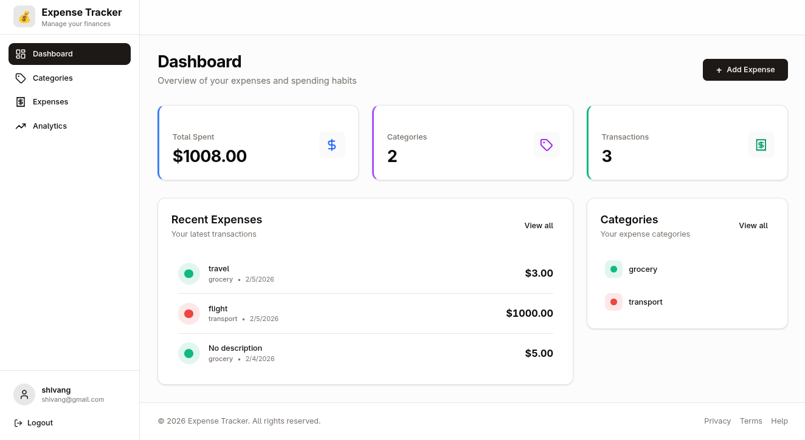

# Expense Tracker

A full-stack expense tracking application built with FastAPI (Python) and Svelte 5, featuring user authentication, category management, expense tracking, and analytics visualization.



## Features

- 🔐 **User Authentication** - Secure registration and login with JWT tokens
- 💰 **Expense Management** - Create, read, update, and delete expenses
- 🏷️ **Category Organization** - Organize expenses with custom categories and colors
- 📊 **Analytics Dashboard** - Visualize spending patterns with charts and graphs
- 🔍 **Advanced Filtering** - Filter expenses by date range and category
- 📱 **Responsive Design** - Modern UI built with Tailwind CSS and shadcn-svelte components

## Tech Stack

### Backend
- **FastAPI** - Modern Python web framework
- **SQLModel** - SQL database ORM with Pydantic integration
- **PostgreSQL** - Relational database
- **JWT** - Token-based authentication
- **Alembic** - Database migrations
- **Argon2** - Password hashing

### Frontend
- **Svelte 5** - Modern reactive framework with runes
- **TypeScript** - Type-safe JavaScript
- **Tailwind CSS** - Utility-first CSS framework
- **Chart.js** - Data visualization
- **shadcn-svelte** - Reusable component library
- **Vite** - Fast build tool

## Project Structure

```
expense-tracker/
├── backend/
│   ├── app/
│   │   ├── analytics.py      # Analytics endpoints
│   │   ├── auth.py           # Authentication routes
│   │   ├── categories.py     # Category management
│   │   ├── expenses.py       # Expense CRUD operations
│   │   ├── users.py          # User profile endpoints
│   │   ├── models.py         # Database models
│   │   ├── schemas.py        # Pydantic schemas
│   │   ├── security.py       # Auth utilities
│   │   ├── config.py         # Configuration
│   │   └── db.py             # Database connection
│   ├── migrations/           # Alembic migrations
│   └── pyproject.toml        # Python dependencies
├── frontend/
│   ├── src/
│   │   ├── lib/
│   │   │   ├── api/          # API client functions
│   │   │   ├── components/   # Reusable components
│   │   │   └── stores/       # Svelte stores
│   │   ├── routes/           # Page components
│   │   ├── router/           # Route guards
│   │   └── main.ts           # App entry point
│   └── package.json          # Node dependencies
└── docker-compose.yaml       # Docker services
```

## Getting Started

### Prerequisites
- Docker & Docker Compose
- Node.js 18+ (for local frontend development)
- Python 3.12+ (for local backend development)

### Environment Setup

Create a `.env` file in the `backend/` directory:

```env
POSTGRES_USER=postgres
POSTGRES_PASSWORD=postgres
POSTGRES_DB=postgres

DATABASE_URL=postgresql://postgres:postgres@db:5432/expense_tracker
SECRET_KEY=your-secret-key-here
ACCESS_TOKEN_EXPIRE_MINUTES=30
```

Create a `.env` file in the `frontend/` directory:

```env
VITE_API_BASE_URL=http://localhost:8000
```

### Running with Docker

```bash
# Start all services
docker-compose up -d

# View logs
docker-compose logs -f

# Stop services
docker-compose down
```

Services will be available at:
- Frontend: http://localhost:3000
- Backend API: http://localhost:8000
- API Documentation: http://localhost:8000/docs

### Local Development

#### Backend

```bash
cd backend

# Install dependencies with uv
uv sync

# Run migrations
alembic upgrade head

# Start development server
uvicorn app.main:app --reload
```

#### Frontend

```bash
cd frontend

# Install dependencies
npm install

# Start development server
npm run dev
```

## API Endpoints

### Authentication
- `POST /auth/register` - Register new user
- `POST /auth/login` - Login and get access token

### Categories
- `GET /categories/` - List all categories
- `POST /categories/` - Create new category

### Expenses
- `GET /expenses/` - List expenses (with filters)
- `POST /expenses/` - Create new expense
- `GET /expenses/{id}` - Get single expense
- `PUT /expenses/{id}` - Update expense
- `DELETE /expenses/{id}` - Delete expense

### Analytics
- `GET /analytics/spending-by-date` - Daily spending data
- `GET /analytics/spending-by-category` - Category breakdown
- `GET /analytics/spending-by-month` - Monthly trends

### Users
- `GET /users/` - Get current user profile

## Database Schema

### Users
- `id` - UUID primary key
- `username` - Unique username
- `email` - Unique email
- `hashed_password` - Argon2 hashed password
- `full_name` - Optional full name
- `disabled` - Account status

### Categories
- `id` - UUID primary key
- `user_id` - Foreign key to users
- `name` - Category name
- `color` - Hex color code

### Expenses
- `id` - UUID primary key
- `user_id` - Foreign key to users
- `category_id` - Foreign key to categories
- `amount` - Expense amount
- `description` - Optional description
- `date` - Expense date
- `created_at` - Timestamp

## Features in Detail

### Dashboard
- Overview statistics (total spent, categories, transactions)
- Recent expenses list
- Quick access to categories
- One-click expense creation

### Expenses
- Complete CRUD operations
- Advanced filtering (date range, category)
- Real-time statistics
- Inline editing and deletion

### Categories
- Color-coded organization
- Search functionality
- Visual category cards
- Custom color picker

### Analytics
- Daily spending line chart
- Category distribution pie chart
- Monthly trends
- Detailed breakdowns with percentages

## Contributing

1. Fork the repository
2. Create a feature branch (`git checkout -b feature/amazing-feature`)
3. Commit your changes (`git commit -m 'Add amazing feature'`)
4. Push to the branch (`git push origin feature/amazing-feature`)
5. Open a Pull Request

## License

This project is licensed under the [MIT](./LICENSE) License.

## Acknowledgments

- [FastAPI](https://fastapi.tiangolo.com/) - Backend framework
- [Svelte](https://svelte.dev/) - Frontend framework
- [shadcn-svelte](https://www.shadcn-svelte.com/) - UI components
- [Chart.js](https://www.chartjs.org/) - Charting library
